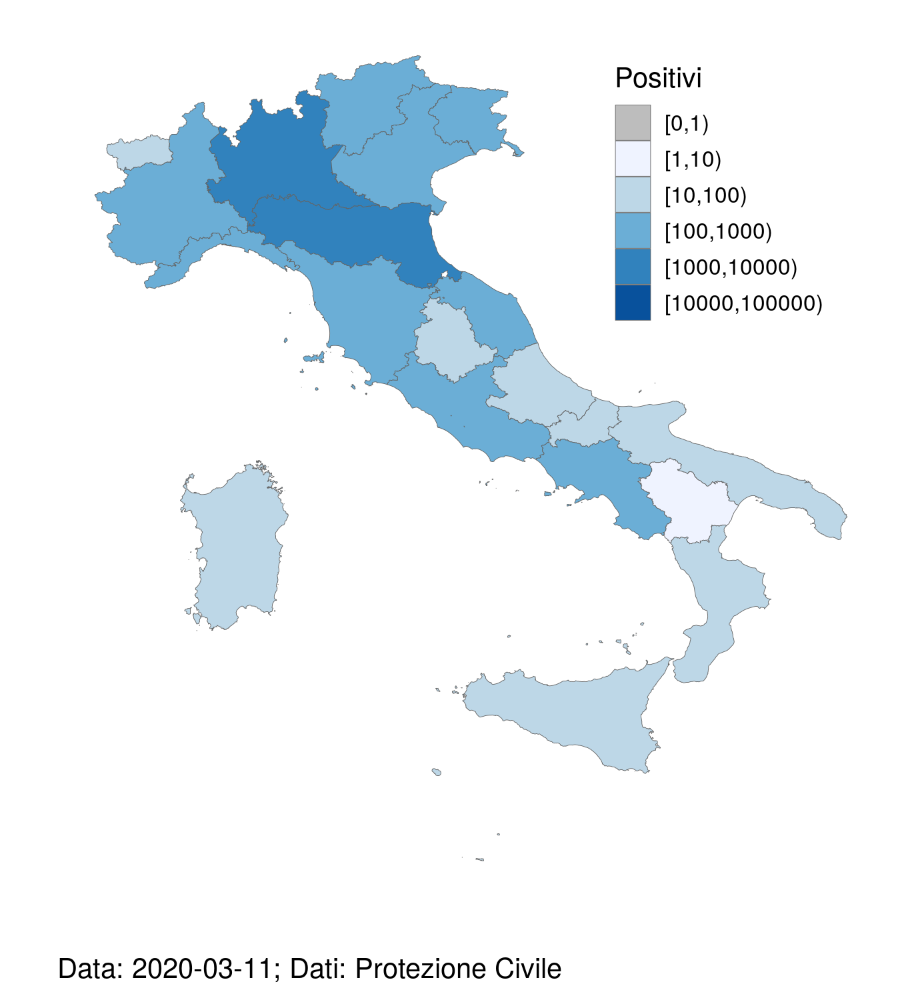
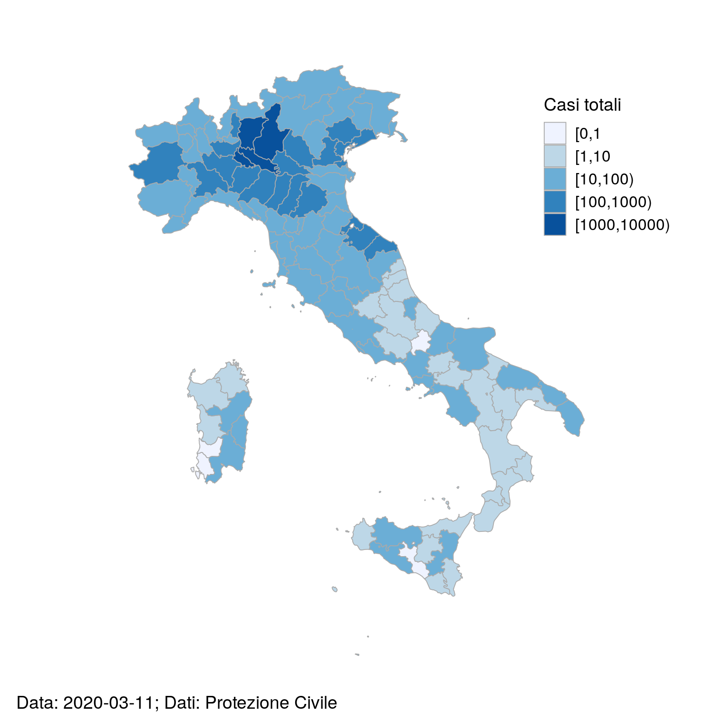

# Mappe italiane COVID-19
L'obiettivo di questo progettino è quello di generare delle mappe "dinamiche" che descrivano l'evoluzione dell'[epidemia di COVID-19](https://it.wikipedia.org/wiki/Epidemia_di_COVID-19_del_2019-2020) in Italia (febbraio-aprile? 2020) e che siano di facile interpretazione. Le mappe dell'università John Hopkins ([apri](https://www.arcgis.com/apps/opsdashboard/index.html#/bda7594740fd40299423467b48e9ecf6)) o quelle proposte dai quotidiani nazionali sono bellissime, ma a mio parere non permettono di seguire l'evoluzione dell'epidemia nello spazio e nel tempo, in particolare a livello delle varie suddivisioni amministrative (regioni/province) . 

## Mappe dinamiche
Le mappe "dinamiche" permettono di visualizzare l'evoluzione dell'epidemia. Ecco la mappa "dinamica" delle regioni:

E quella delle province:

Le mappe sono disponibili per il download nelle cartelle `out_mappa_dinamica_regioni` e `out_mappa_dinamica_province`.

## Filmati .mp4

I filmati `.mp4` forniscono le stesse informazioni delle mappe "dinamiche", ma permettono all'utente interrompere la riproduzione del filmato e fare i confronti che desidera invece di dover aspettare il ciclo successivo delle immagini `.gif` animate. I filmati sono disponibili nelle cartelle `out/mp4_dinamica_regioni` e `out_mp4_dinamica_province`.

## Mappe giornaliere

Le mappe giornaliere sono mappe "statiche" che permettono di capire quanti casi positivi c'erano/ci sono in un determinato giorno e fare confronti tra regioni/province. Ecco la mappa più recente delle regioni:

E quella delle province:

Le altre mappe sono disponibili nelle cartelle `out/mappe_giornaliere_regioni` e `out_mappe_giornaliere_province`.

## Note

### Fonti dei dati
I dati sono stati ottenuti dal [repository github COVID-19](https://github.com/pcm-dpc/COVID-19) della [Protezione Civile](http://www.protezionecivile.gov.it/home).

### Licenza

Le immagini (`.gif`, `.png`) e i filmati (`.mp4`) sono rilasciati con licenza Creative Commons [CC-BY-4.0](https://creativecommons.org/licenses/by/4.0/deed.it). Gli script sono rilasciati con licenza `GPLv3`.

### Implementazione
Gli script per generare le mappe / immagini .gif / filmati sono scritti in `R`. I pacchetti chiave sono `ggplot2`, `mapIT`, `choroplethrAdmin1`, `lubridate` e `RColorBrewer`. Gli script utilizzano `ffmpeg` per generare le `.gif` e i filmati e sono stati testati su Linux (Ubuntu 18.04.4 LTS).

### Problemi noti relativi ai nomi/confini delle regioni/province 
Per questioni di semplicità  e compatibilità con i pacchetti `R` nella mappa delle regioni le province autonome di Trento e Bolzano sono state accorpate nel Trentino-Alto Adige (e purtroppo manca anche la dizione "/Südtirol"). Per le stesse ragioni la mappa delle province contiene delle province che non esistono più (Carbonia-Iglesias, Medio Campidano, Ogliastra e Olbia-Tempio).

### Miglioramenti possibili

- Per risolvere i problemi relativi alle ai nomi/confini delle province/regioni si potrebbero utilizzare i file `.geojson` del progetto [Openpolis / geojson-italy](https://github.com/openpolis/geojson-italy/) e utilizzare altri pacchetti `R` per visualizzare le mappe. 
- Il colore e la dimensione del tratto utilizzato per delimitare i confini delle province non sono ottimali. La documentazione di `choroplethr`  disponibile gratuitamente è piuttosto scarsa.
- Migliorare la gestione della codifica dei file (fileEncoding)